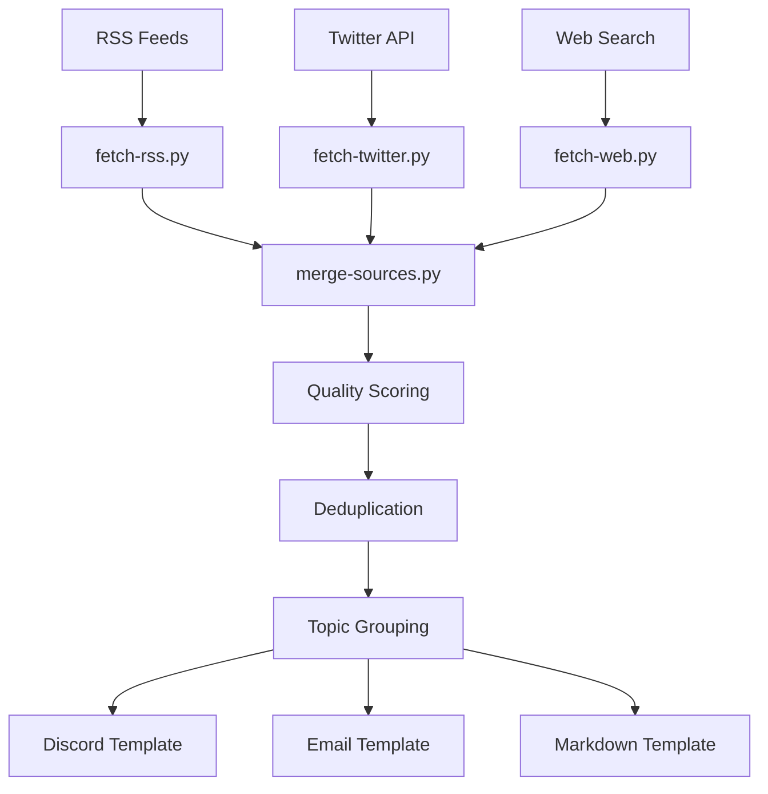

# Tech Digest v2.0

> **Automated tech news digest system with unified source model, quality scoring, and multi-format output.**

Generate comprehensive tech digests by aggregating content from RSS feeds, Twitter/X KOLs, and web search, with intelligent deduplication, quality scoring, and template-based output for Discord, email, or markdown.

[](https://www.python.org/downloads/)
[](LICENSE)

## ✨ Features

### 🔄 Unified Data Pipeline
- **Multi-Source Collection**: RSS feeds, Twitter/X API, web search
- **Parallel Processing**: Concurrent fetching with retry mechanisms
- **Quality Scoring**: Multi-source detection, priority weighting, engagement metrics
- **Smart Deduplication**: Title similarity detection and domain saturation limits

### 📊 Advanced Configuration
- **Unified Source Model**: Single configuration for all source types
- **Enhanced Topics**: Rich topic definitions with search queries and content filters
- **User Customization**: Workspace-level config overrides
- **Schema Validation**: JSON schema validation with consistency checks

### 📝 Multi-Format Output
- **Discord**: Mobile-optimized bullet lists with link suppression
- **Email**: Rich metadata, technical stats, and executive summaries
- **Markdown**: GitHub-compatible tables and expandable sections

## 📦 Installation

### Option 1: Chat with your OpenClaw bot (easiest)
Just tell your bot:
> Install tech-digest skill from https://github.com/draco-hoard/tech-digest and set up daily/weekly digests for me

Your bot will clone the repo, configure sources, create cron jobs, and start delivering digests — all through conversation. No manual setup needed.

### Option 2: ClawHub (coming soon)
```bash
clawhub install tech-digest
```

### Option 3: Manual install via GitHub
```bash
# Clone into OpenClaw skills directory
cd ~/.openclaw/workspace/skills
git clone https://github.com/draco-hoard/tech-digest.git

# Optional Python dependencies
pip install -r tech-digest/requirements.txt
```

## 🚀 Quick Start

### 1. Configuration
```bash
# Copy default configs to workspace for customization
mkdir -p workspace/config
cp config/defaults/sources.json workspace/config/
cp config/defaults/topics.json workspace/config/

# Set API keys (optional but recommended)
export X_BEARER_TOKEN="your_twitter_bearer_token"
export BRAVE_API_KEY="your_brave_search_api_key"
```

### 2. Generate Digest
```bash
# Fetch from all sources
python3 scripts/fetch-rss.py --config workspace/config --hours 48
python3 scripts/fetch-twitter.py --config workspace/config --hours 48
python3 scripts/fetch-web.py --config workspace/config --freshness 48h

# Merge with quality scoring
python3 scripts/merge-sources.py \
  --rss tech-digest-rss-*.json \
  --twitter tech-digest-twitter-*.json \
  --web tech-digest-web-*.json \
  --output digest.json

# Apply template (Discord example)
# Use digest.json with references/templates/discord.md
```

### 3. Validate Configuration
```bash
python3 scripts/validate-config.py --config-dir workspace/config --verbose
```

## 📋 Pipeline Scripts

| Script | Purpose | Key Features |
|--------|---------|--------------|
| `fetch-rss.py` | RSS feed fetcher | feedparser + regex fallback, parallel processing, retry logic |
| `fetch-twitter.py` | Twitter/X KOL monitor | API v2, rate limit handling, engagement metrics |
| `fetch-web.py` | Web search engine | Brave API or agent interface, content filtering |
| `merge-sources.py` | Quality scoring & deduplication | Multi-source detection, title similarity, topic grouping |
| `validate-config.py` | Configuration validator | JSON schema, consistency checks, source validation |

## 🎯 Default Sources (65 total)

### RSS Feeds (32)
- **AI/ML**: OpenAI, Anthropic, Hugging Face, Sebastian Raschka, Simon Willison
- **Crypto**: Vitalik Buterin, CoinDesk, The Block, Decrypt
- **Tech**: Hacker News, Ars Technica, TechCrunch, Paul Graham, antirez
- **Chinese**: 36氪, 机器之心, 量子位, InfoQ, 极客公园

### Twitter/X KOLs (29)
- **AI Labs**: @sama, @OpenAI, @AnthropicAI, @ylecun, @GoogleDeepMind
- **AI Builders**: @karpathy, @AndrewYNg, @jimfan_, @huggingface
- **Crypto**: @VitalikButerin, @cz_binance, @saylor, @WuBlockchain
- **Tech Leaders**: @elonmusk, @sundarpichai, @pmarca

### Web Search Topics (4)
- **LLM / Large Models**: Latest model releases, benchmarks, breakthroughs
- **AI Agent**: Autonomous agents, frameworks, agentic systems
- **Cryptocurrency**: Bitcoin, Ethereum, DeFi, blockchain developments  
- **Frontier Tech**: Quantum, biotech, robotics, emerging technologies

## ⚙️ Configuration

### Sources Configuration (`sources.json`)
```json
{
  "sources": [
    {
      "id": "openai-rss",
      "type": "rss",
      "name": "OpenAI Blog",
      "url": "https://openai.com/blog/rss.xml",
      "enabled": true,
      "priority": true,
      "topics": ["llm", "ai-agent"],
      "note": "Official OpenAI updates"
    },
    {
      "id": "sama-twitter",
      "type": "twitter",
      "name": "Sam Altman",
      "handle": "sama", 
      "enabled": true,
      "priority": true,
      "topics": ["llm", "frontier-tech"]
    }
  ]
}
```

### Topics Configuration (`topics.json`)
```json
{
  "topics": [
    {
      "id": "llm",
      "emoji": "🧠",
      "label": "LLM / Large Models", 
      "description": "Large Language Models, foundation models, breakthroughs",
      "search": {
        "queries": ["LLM latest news", "large language model breakthroughs"],
        "must_include": ["LLM", "large language model"],
        "exclude": ["tutorial", "beginner guide"]
      },
      "display": {
        "max_items": 8,
        "style": "detailed"
      }
    }
  ]
}
```

## 🏗️ Architecture



## 🎨 Templates & Output

### Discord Format
- Bullet lists with `<link>` suppression
- Mobile-optimized emoji headers
- 2000 character awareness

### Email Format  
- Executive summary with technical stats
- Rich metadata and archive links
- Top articles highlighting

### Markdown Format
- GitHub-compatible tables
- Expandable technical details
- Cross-reference navigation

## 📊 Quality Scoring System

| Factor | Points | Description |
|--------|--------|-------------|
| **Multi-Source** | +5 each | Article appears in multiple sources |
| **Priority Source** | +3 | From high-priority RSS/Twitter source |
| **Recency** | +2 | Published within last 24 hours |
| **Engagement** | +1 | High Twitter likes/retweets |
| **Duplicate** | -10 | Very similar to existing article |
| **Previous Digest** | -5 | Already appeared in recent digest |

## 🔧 Environment Setup

### Required Environment Variables
```bash
# Twitter API (recommended)
export X_BEARER_TOKEN="your_bearer_token_here"

# Brave Search API (optional, fallback to agent)
export BRAVE_API_KEY="your_brave_api_key"
```

### Git Configuration (for auto-commit)
```bash
git config user.name "Your Name"
git config user.email "your.email@example.com"
git config user.signingkey "your_gpg_key_id"  # Optional
git config commit.gpgsign true  # Optional
```

## 🚦 Usage Examples

### Daily Digest
```bash
#!/bin/bash
# daily-digest.sh
cd /path/to/tech-digest

# Fetch all sources
python3 scripts/fetch-rss.py --config workspace/config --hours 24
python3 scripts/fetch-twitter.py --config workspace/config --hours 24  
python3 scripts/fetch-web.py --config workspace/config --freshness 24h

# Merge and score
python3 scripts/merge-sources.py \
  --rss tech-digest-rss-*.json \
  --twitter tech-digest-twitter-*.json \
  --web tech-digest-web-*.json \
  --archive-dir workspace/archive/tech-digest \
  --output merged-$(date +%Y%m%d).json

# Apply template and deliver (implementation specific)
```

### Custom Source Configuration
```json
// workspace/config/sources.json - User overrides
{
  "sources": [
    // Disable noisy default source
    {
      "id": "reddit-ml-rss",
      "enabled": false
    },
    // Add custom source
    {
      "id": "my-tech-blog",
      "type": "rss", 
      "name": "My Tech Blog",
      "url": "https://myblog.com/rss",
      "enabled": true,
      "priority": true,
      "topics": ["frontier-tech"],
      "note": "Personal tech blog"
    }
  ]
}
```

## 🔍 Troubleshooting

### Common Issues

**RSS Feeds Failing**
```bash
python3 scripts/fetch-rss.py --verbose  # Check detailed logs
python3 scripts/validate-config.py      # Validate URLs
```

**Twitter Rate Limits**  
```bash
# Reduce frequency or sources
export X_BEARER_TOKEN="new_token"       # Try different token
```

**Configuration Errors**
```bash
python3 scripts/validate-config.py --verbose  # Detailed validation
```

**No Articles Found**
```bash
# Check time window
python3 scripts/fetch-rss.py --hours 168  # Try 1 week

# Check source enablement
grep '"enabled": false' workspace/config/sources.json
```

### Debug Mode
All scripts support `--verbose` flag:
```bash
python3 scripts/fetch-rss.py --verbose --hours 1
```

## 🤝 Contributing

### Development Setup
```bash
git clone https://github.com/draco-hoard/tech-digest
cd tech-digest

# Install development dependencies  
pip install -r requirements.txt
pip install pytest black flake8

# Run tests
python3 -m pytest tests/

# Format code
black scripts/ 
```

### Adding New Sources
1. Add to `config/defaults/sources.json`
2. Update topic assignments
3. Run `python3 scripts/validate-config.py`
4. Test with `fetch-*.py --verbose`

### Adding New Topics
1. Add to `config/defaults/topics.json`
2. Define search queries and filters
3. Update existing sources' topic assignments
4. Test web search integration

## 📄 License

MIT License - see [LICENSE](LICENSE) for details.

## 🙏 Acknowledgments

- **RSS Sources**: Thanks to all the amazing tech bloggers and publications
- **API Providers**: Twitter/X API, Brave Search API
- **Libraries**: feedparser, jsonschema (optional dependencies)
- **Community**: Open source contributors and feedback providers

---

**Tech Digest v2.0** - Built with ❤️ for the tech community