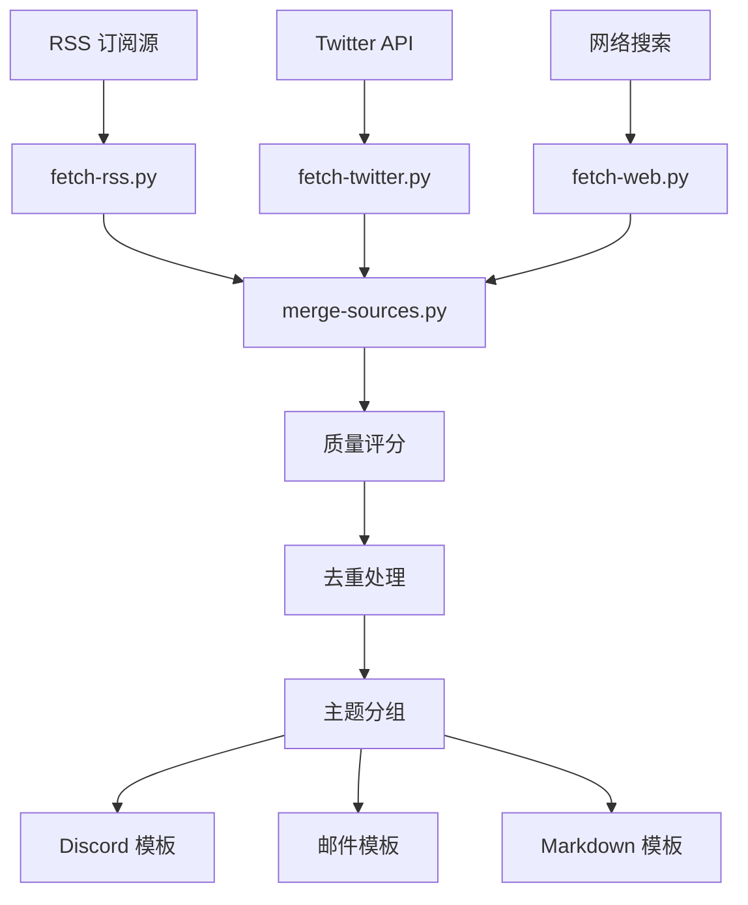

# Tech Digest v2.0

> **统一数据源模型的自动化科技资讯汇总系统，支持质量评分和多格式输出**

通过聚合 RSS 订阅源、Twitter/X KOL 动态和网络搜索内容，提供智能去重、质量评分和模板化输出的综合科技资讯汇总，支持 Discord、邮件或 Markdown 格式。

[](https://www.python.org/downloads/)
[](LICENSE)

## ✨ 主要特性

### 🔄 统一数据管道
- **多源数据收集**：RSS 订阅、Twitter/X API、网络搜索
- **并行处理**：带重试机制的并发抓取
- **质量评分**：多源检测、优先级权重、互动指标
- **智能去重**：标题相似度检测和域名饱和度限制

### 📊 高级配置系统
- **统一源模型**：所有数据源类型的单一配置
- **增强主题定义**：包含搜索查询和内容过滤器的丰富主题
- **用户自定义**：工作区级别的配置覆盖
- **模式校验**：JSON Schema 校验和一致性检查

### 📝 多格式输出
- **Discord**：移动端优化的项目符号列表，链接抑制
- **邮件**：丰富元数据、技术统计和执行摘要
- **Markdown**：GitHub 兼容的表格和可展开章节

## 🚀 快速开始

### 安装

#### 方式一：和你的 OpenClaw bot 对话（最简单）
直接告诉你的 bot：
> 从 https://github.com/draco-hoard/tech-digest 安装 tech-digest skill，帮我配置每日/每周科技资讯摘要

Bot 会自动 clone 仓库、配置数据源、创建定时任务、开始推送摘要——全程对话完成，无需手动操作。

#### 方式二：通过 ClawHub（即将上线）
```bash
clawhub install tech-digest
```

#### 方式三：手动安装
```bash
# Clone 到 OpenClaw skills 目录
cd ~/.openclaw/workspace/skills
git clone https://github.com/draco-hoard/tech-digest.git

# 可选 Python 依赖
pip install -r tech-digest/requirements.txt
```

### 1. 配置
```bash
# 复制默认配置到工作区进行自定义
mkdir -p workspace/config
cp config/defaults/sources.json workspace/config/
cp config/defaults/topics.json workspace/config/

# 设置 API 密钥（可选但推荐）
export X_BEARER_TOKEN="你的_twitter_bearer_token"
export BRAVE_API_KEY="你的_brave_search_api_key"
```

### 3. 生成资讯汇总
```bash
# 从所有源抓取数据
python3 scripts/fetch-rss.py --config workspace/config --hours 48
python3 scripts/fetch-twitter.py --config workspace/config --hours 48
python3 scripts/fetch-web.py --config workspace/config --freshness 48h

# 合并并进行质量评分
python3 scripts/merge-sources.py \
  --rss tech-digest-rss-*.json \
  --twitter tech-digest-twitter-*.json \
  --web tech-digest-web-*.json \
  --output digest.json

# 应用模板（Discord 示例）
# 使用 digest.json 配合 references/templates/discord.md
```

### 4. 配置校验
```bash
python3 scripts/validate-config.py --config-dir workspace/config --verbose
```

## 📋 管道脚本

| 脚本 | 用途 | 主要特性 |
|------|------|----------|
| `fetch-rss.py` | RSS 订阅抓取器 | feedparser + 正则表达式回退，并行处理，重试逻辑 |
| `fetch-twitter.py` | Twitter/X KOL 监控器 | API v2，速率限制处理，互动指标 |
| `fetch-web.py` | 网络搜索引擎 | Brave API 或 agent 接口，内容过滤 |
| `merge-sources.py` | 质量评分与去重 | 多源检测，标题相似度，主题分组 |
| `validate-config.py` | 配置校验器 | JSON Schema，一致性检查，数据源校验 |

## 🎯 默认数据源（共 65 个）

### RSS 订阅源（32 个）
- **AI/ML**：OpenAI、Anthropic、Hugging Face、Sebastian Raschka、Simon Willison
- **加密货币**：Vitalik Buterin、CoinDesk、The Block、Decrypt
- **科技资讯**：Hacker News、Ars Technica、TechCrunch、Paul Graham、antirez
- **中文媒体**：36氪、机器之心、量子位、InfoQ、极客公园

### Twitter/X KOL（29 个）
- **AI 实验室**：@sama、@OpenAI、@AnthropicAI、@ylecun、@GoogleDeepMind
- **AI 开发者**：@karpathy、@AndrewYNg、@jimfan_、@huggingface
- **加密货币**：@VitalikButerin、@cz_binance、@saylor、@WuBlockchain
- **科技领袖**：@elonmusk、@sundarpichai、@pmarca

### 网络搜索主题（4 个）
- **LLM / 大语言模型**：最新模型发布、基准测试、突破性进展
- **AI 智能体**：自主代理、框架、智能体系统
- **加密货币**：比特币、以太坊、DeFi、区块链发展
- **前沿科技**：量子计算、生物技术、机器人技术、新兴技术

## ⚙️ 配置说明

### 数据源配置 (`sources.json`)
```json
{
  "sources": [
    {
      "id": "openai-rss",
      "type": "rss",
      "name": "OpenAI Blog",
      "url": "https://openai.com/blog/rss.xml",
      "enabled": true,
      "priority": true,
      "topics": ["llm", "ai-agent"],
      "note": "OpenAI 官方更新"
    },
    {
      "id": "sama-twitter",
      "type": "twitter",
      "name": "Sam Altman",
      "handle": "sama", 
      "enabled": true,
      "priority": true,
      "topics": ["llm", "frontier-tech"]
    }
  ]
}
```

### 主题配置 (`topics.json`)
```json
{
  "topics": [
    {
      "id": "llm",
      "emoji": "🧠",
      "label": "LLM / 大语言模型", 
      "description": "大语言模型、基础模型、突破性进展",
      "search": {
        "queries": ["LLM最新动态", "大语言模型突破"],
        "must_include": ["LLM", "大语言模型"],
        "exclude": ["教程", "新手指南"]
      },
      "display": {
        "max_items": 8,
        "style": "detailed"
      }
    }
  ]
}
```

## 🏗️ 系统架构



## 🎨 模板与输出

### Discord 格式
- 使用 `<link>` 抑制的项目符号列表
- 移动端优化的表情符号标题
- 2000 字符限制感知

### 邮件格式  
- 带技术统计的执行摘要
- 丰富的元数据和存档链接
- 重点文章高亮显示

### Markdown 格式
- GitHub 兼容的表格
- 可展开的技术详细信息
- 交叉引用导航

## 📊 质量评分系统

| 因子 | 分数 | 描述 |
|------|------|------|
| **多源文章** | +5 每个 | 文章在多个数据源中出现 |
| **优先级源** | +3 | 来自高优先级 RSS/Twitter 源 |
| **时效性** | +2 | 24 小时内发布 |
| **互动度** | +1 | Twitter 高点赞/转发 |
| **重复内容** | -10 | 与现有文章非常相似 |
| **历史重复** | -5 | 已在近期资讯汇总中出现 |

## 🔧 环境设置

### 必需环境变量
```bash
# Twitter API（推荐）
export X_BEARER_TOKEN="你的_bearer_token"

# Brave Search API（可选，回退到 agent）
export BRAVE_API_KEY="你的_brave_api_key"
```

### Git 配置（用于自动提交）
```bash
git config user.name "你的姓名"
git config user.email "你的邮箱@example.com"
git config user.signingkey "你的_gpg_key_id"  # 可选
git config commit.gpgsign true  # 可选
```

## 🚦 使用示例

### 每日资讯汇总
```bash
#!/bin/bash
# daily-digest.sh
cd /path/to/tech-digest

# 抓取所有源
python3 scripts/fetch-rss.py --config workspace/config --hours 24
python3 scripts/fetch-twitter.py --config workspace/config --hours 24  
python3 scripts/fetch-web.py --config workspace/config --freshness 24h

# 合并和评分
python3 scripts/merge-sources.py \
  --rss tech-digest-rss-*.json \
  --twitter tech-digest-twitter-*.json \
  --web tech-digest-web-*.json \
  --archive-dir workspace/archive/tech-digest \
  --output merged-$(date +%Y%m%d).json

# 应用模板并发送（具体实现相关）
```

### 自定义数据源配置
```json
// workspace/config/sources.json - 用户覆盖
{
  "sources": [
    // 禁用嘈杂的默认源
    {
      "id": "reddit-ml-rss",
      "enabled": false
    },
    // 添加自定义源
    {
      "id": "my-tech-blog",
      "type": "rss", 
      "name": "我的科技博客",
      "url": "https://myblog.com/rss",
      "enabled": true,
      "priority": true,
      "topics": ["frontier-tech"],
      "note": "个人科技博客"
    }
  ]
}
```

## 🔍 故障排除

### 常见问题

**RSS 订阅源失败**
```bash
python3 scripts/fetch-rss.py --verbose  # 查看详细日志
python3 scripts/validate-config.py      # 校验 URL
```

**Twitter 速率限制**  
```bash
# 减少频率或数据源
export X_BEARER_TOKEN="新_token"       # 尝试不同 token
```

**配置错误**
```bash
python3 scripts/validate-config.py --verbose  # 详细校验
```

**未找到文章**
```bash
# 检查时间窗口
python3 scripts/fetch-rss.py --hours 168  # 尝试 1 周

# 检查源启用状态
grep '"enabled": false' workspace/config/sources.json
```

### 调试模式
所有脚本都支持 `--verbose` 参数：
```bash
python3 scripts/fetch-rss.py --verbose --hours 1
```

## 🤝 贡献指南

### 开发环境设置
```bash
git clone https://github.com/draco-hoard/tech-digest
cd tech-digest

# 安装开发依赖
pip install -r requirements.txt
pip install pytest black flake8

# 运行测试
python3 -m pytest tests/

# 格式化代码
black scripts/ 
```

### 添加新数据源
1. 添加到 `config/defaults/sources.json`
2. 更新主题分配
3. 运行 `python3 scripts/validate-config.py`
4. 使用 `fetch-*.py --verbose` 测试

### 添加新主题
1. 添加到 `config/defaults/topics.json`
2. 定义搜索查询和过滤器
3. 更新现有数据源的主题分配
4. 测试网络搜索集成

## 📄 开源协议

MIT License - 详见 [LICENSE](LICENSE)

## 🙏 致谢

- **RSS 数据源**：感谢所有优秀的科技博主和媒体
- **API 提供商**：Twitter/X API、Brave Search API
- **开源库**：feedparser、jsonschema（可选依赖）
- **社区**：开源贡献者和反馈提供者

---

**Tech Digest v2.0** - 用 ❤️ 为科技社区打造